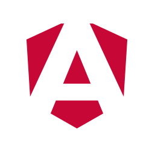
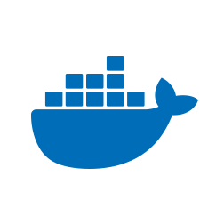
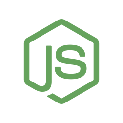

<h1>BookStore</h1> 
This project was generated with [Angular CLI](https://github.com/angular/angular-cli) version 17.3.10.

BookStore is a web application developed to offer an intuitive and efficient online book purchasing experience. Using modern technologies such as Angular for the front-end and NestJS for the back-end, the project aims to create a robust and scalable platform.

Front-end: Angular, TypeScript, Angular Material.

Backend: NestJS, TypeScript, PostgreSQL for database, JWT for authentication.

DevOps: Docker for containerization, CI/CD with GitHub Actions.

The objective of the project is to demonstrate skills in full-stack development, from creating an interactive and responsive user interface to implementing a secure and efficient API. This project also demonstrates skills in DevOps practices, ensuring that the application is ready to be deployed in production environments.  

## Development server

Run `ng serve` for a dev server. Navigate to `http://localhost:4200/`. The application will automatically reload if you change any of the source files.

## Build

Run `ng build` to build the project. The build artifacts will be stored in the `dist/` directory.

## Running unit tests

Run `ng test` to execute the unit tests via [Karma](https://karma-runner.github.io).

